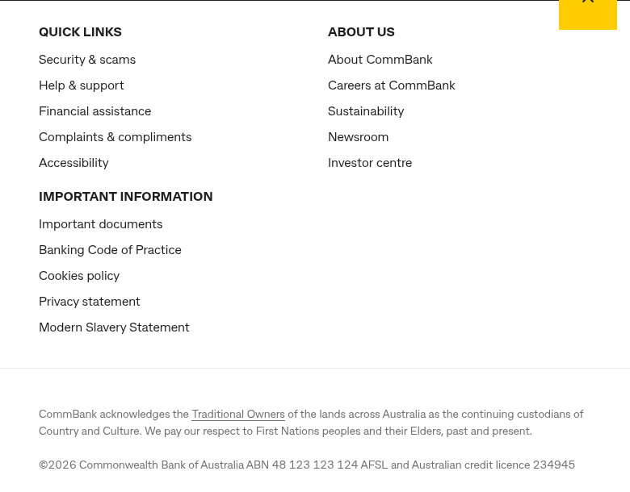
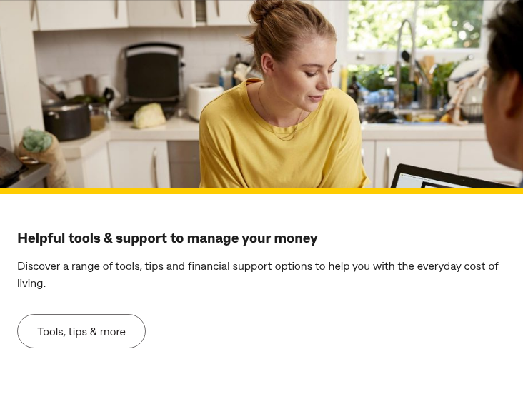
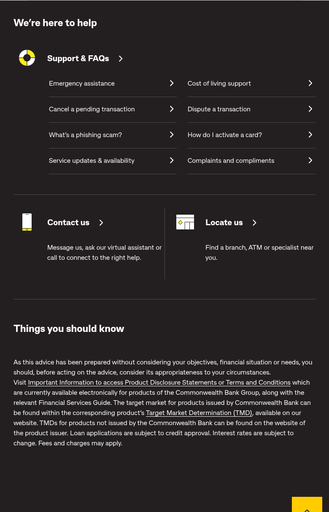
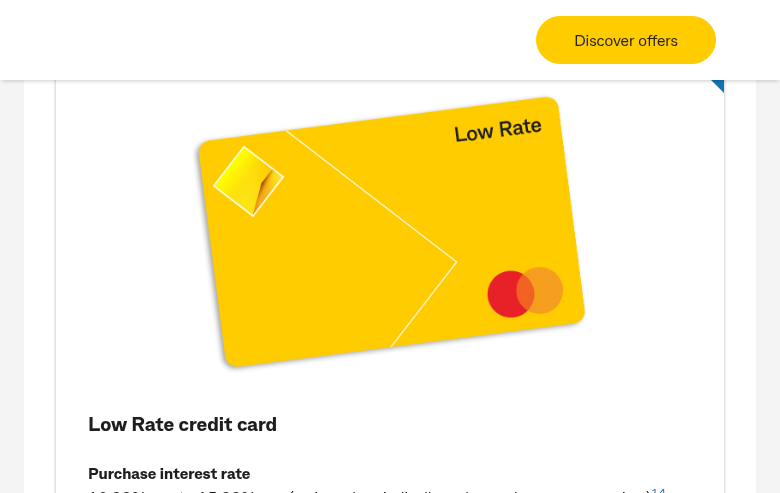
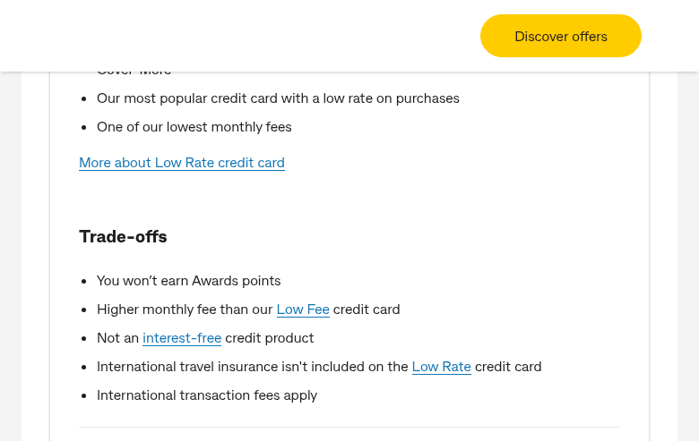

# CommBank.com.au — Comprehensive Site Analysis Report

**Site:** https://www.commbank.com.au/
**Date:** 24 February 2026
**Current CMS:** Adobe Experience Manager (AEM/CQ)
**Target Platform:** Adobe Edge Delivery Services (AEM Sites)

---

## 1. Templates Inventory

| # | Template Name | Complexity | Reasoning | Reference URL(s) |
|---|---|---|---|---|
| 1 | **Homepage** | **High** | Multiple personalization zones (Adobe Target mbox), rotating hero, 7+ distinct section types, A/B testing containers, complex product grid with sub-links | https://www.commbank.com.au/ |
| 2 | **Product Category Landing** | **High** | Hero + icon navigation grid (6–8 tiles with sub-links), audience segmentation cards, promotional blocks, app showcase section, multiple CTA patterns | https://www.commbank.com.au/banking.html, https://www.commbank.com.au/business.html, https://www.commbank.com.au/insurance.html |
| 3 | **Product Listing / Comparison** | **High** | Repeating product cards with metrics tables (rates, fees), dual-path CTAs (existing vs new customer), expandable "Trade-offs" sections, anchor navigation, heavy compliance footnotes | https://www.commbank.com.au/credit-cards.html, https://www.commbank.com.au/personal-loans.html |
| 4 | **Product Detail** | **High** | Dual CTA hero, persona segmentation cards (6 audience types), feature highlight cards, payment integration logos, promotional stacking, application modals with conditional branching | https://www.commbank.com.au/banking/everyday-accounts.html, https://www.commbank.com.au/bank-accounts/complete-access.html |
| 5 | **Rates / Calculator Tool** | **High** | Interactive form-based calculator with real-time updates, dynamic product comparison cards, tab-based period selection, LVR calculations, template variables, heaviest JS interactivity | https://www.commbank.com.au/home-loans/interest-rates.html, https://www.commbank.com.au/home-loans/borrowing-power-calculator.html |
| 6 | **Product Marketing Funnel** | **High** | Adobe Target hero personalization, modal dialogs with conditional branching for apply/refinance, partnership integration blocks, hybrid of category landing and rates tool | https://www.commbank.com.au/home-loans.html |
| 7 | **Support / Help Hub** | **Low** | Minimal content; search hero, popular topics grid (3×3), contact CTA cards. Simplest template on the site | https://www.commbank.com.au/support.html |
| 8 | **Support Article / FAQ** | **Medium** | Individual support article with Q&A format, breadcrumb navigation, related articles sidebar, search integration | https://www.commbank.com.au/support.banking.what-is-a-bsb-number.html |
| 9 | **Corporate / About** | **Medium** | Accordion sections (Who We Are, Leadership, Investors, Sustainability, Newsroom, Careers), text-heavy informational blocks, 3-column card grids, no product CTAs | https://www.commbank.com.au/about-us.html |
| 10 | **Editorial / Content Hub** | **Medium** | Category navigation tiles, article card grids/carousels, "Load more" pagination, YouTube embeds, dropdown-based interactive tool, themed content sections | https://www.commbank.com.au/brighter.html |
| 11 | **Article Detail** | **Medium** | Long-form editorial content with hero image, author attribution, social sharing, inline images, related articles section | https://www.commbank.com.au/brighter/financial-education/online-dating-scams.html |
| 12 | **Calculator / Tool Page** | **High** | Standalone interactive tools (repayment calculator, FX calculator, borrowing power), heavy JavaScript with form validation and real-time output | https://www.commbank.com.au/digital/home-buying/calculator/home-loan-repayments, https://www.commbank.com.au/international/foreign-exchange-calculator.html |
| 13 | **Branch / ATM Locator** | **High** | SPA-based map interface, geolocation, search by suburb/postcode, service type filtering, directions integration | https://www.commbank.com.au/digital/locate-us/ |
| 14 | **Application / Origination Form** | **High** | Multi-step form wizards, identity verification, conditional fields, session management, integration with banking systems | https://www.commbank.com.au/digital/eosmartaccess/ntb |
| 15 | **Newsroom / Media** | **Medium** | Press release listing, date-filtered archive, media contact information, downloadable assets | https://www.commbank.com.au/newsroom.html |

---

## 2. Blocks / Components Catalog

### Global Components (Present on All Pages)

| # | Block Name | Complexity | Description | Reference URL(s) |
|---|---|---|---|---|
| 1 | **Header / Global Navigation** | **High** | Hamburger menu, CommBank logo, search overlay dialog with popular suggestions, multi-portal login dropdown (NetBank, CommBiz, CommSec), mega-menu with 7 primary categories each containing sub-links. Responsive with mobile-first hamburger pattern. | All pages — https://www.commbank.com.au/ |
| 2 | **Footer** | **Medium** | 3-column link layout (Quick Links, About Us, Important Information), "Back to top" button, Traditional Owners acknowledgment, copyright/legal text. Consistent across all pages. | All pages |
| 3 | **"Things You Should Know" Disclaimer** | **Low** | Regulatory compliance text block with links to Important Information, Product Disclosure Statements, and Target Market Determinations. Required by AFSL regulations. | All product pages |

**Screenshot — Header:**

**Screenshot — Footer:**

---

### Content Blocks

| # | Block Name | Complexity | Description | Variations | Reference URL(s) |
|---|---|---|---|---|---|
| 4 | **Hero Banner** | **Medium** | Full-width image with headline, description text, and CTA button. Yellow accent border. May include Adobe Target personalization containers. | - Standard (image + text + CTA) - Personalized (Adobe Target mbox) - Category hero (heading + subtext, no CTA) | https://www.commbank.com.au/ (standard), https://www.commbank.com.au/home-loans.html (personalized), https://www.commbank.com.au/banking.html (category) |
| 5 | **Product/Service Navigation Grid** | **High** | 6-tile icon grid with SVG pictograms. Each tile has: icon, heading with arrow, 3 sub-links. Responsive 2-column on mobile, 3-column on desktop. | - Homepage variant (6 tiles with sub-links) - Category variant (8 tiles, icons only) | https://www.commbank.com.au/ (homepage), https://www.commbank.com.au/banking.html (category) |
| 6 | **Promotional Banner** | **Medium** | Image + text split layout with heading, body copy, and CTA button. Used for time-limited campaigns and featured offers. | - Image-left variant - Image-right variant - Full-width variant | https://www.commbank.com.au/ (AFC Women's Asian Cup), https://www.commbank.com.au/banking.html (cashback offer) |
| 7 | **Article Card** | **Medium** | Image + heading + description + "Read more" link. Used in 2-column and 4-column grids. Image on top, text below. | - 2-column grid (large cards) - 4-column grid (compact cards) - Horizontal card (image-left) - Mini card (thumbnail + title only) | https://www.commbank.com.au/ (4-col), https://www.commbank.com.au/brighter.html (multiple variants) |
| 8 | **Product Comparison Card** | **High** | Complex card with: product image, product name, key metrics table (rate, fees, limit), feature list, "Trade-offs" section, dual CTAs (existing/new customer), expandable "Tell me more" link. | - Credit card variant (card image + rates table) - Home loan variant (rate + comparison rate + repayment calc) - Savings account variant | https://www.commbank.com.au/credit-cards.html, https://www.commbank.com.au/home-loans/interest-rates.html |
| 9 | **Icon Link Card** | **Low** | SVG pictogram + heading + short description + CTA link. Used in support and help sections. | - 2-column layout - 4-column layout - With description - Icon-only variant | https://www.commbank.com.au/support.html (We're here to help), https://www.commbank.com.au/banking.html (help section) |
| 10 | **Audience Segmentation Cards** | **Medium** | Cards targeting specific customer personas (Kids, Students, Moving to Australia, Travel, Business). Each has heading, description text, and CTA. | - Simple text card - Card with sub-links | https://www.commbank.com.au/banking.html (Banking for the stage you're at) |
| 11 | **App Showcase Block** | **Medium** | Split layout with app screenshot image and feature list with bullet points. Includes App Store and Google Play download badges. | - Standard (features + badges) - Stats variant (with user count) | https://www.commbank.com.au/banking.html (Australia's best banking app) |
| 12 | **Support & FAQ Quick Links** | **Medium** | Icon + heading + list of 8 FAQ links in 2-column grid. Dark background variant. Plus Contact Us and Locate Us cards below. | - Homepage variant (full support hub) - Category page variant (4 icon cards) | https://www.commbank.com.au/ (We're here to help) |
| 13 | **Financial Assistance CTA** | **Low** | Centered text block with heading and single CTA button. Used as a callout for financial difficulty support. | Single variant | https://www.commbank.com.au/ (Are you experiencing financial difficulty?) |
| 14 | **"More from CommBank" Carousel** | **Medium** | Mixed-content carousel with large cards (image + heading + text + CTA) and mini cards (thumbnail + title link). 3 items per row. | - Large card variant - Mini stacked cards variant | https://www.commbank.com.au/ |
| 15 | **Accordion Section** | **Medium** | Expandable/collapsible content sections with button triggers. Used on corporate pages for organizing large amounts of content. | - Standard accordion - Auto-expanded variant | https://www.commbank.com.au/about-us.html |
| 16 | **Three-Column Info Cards** | **Medium** | Image + heading + description + CTA link in 3-column grid layout. Used for sustainability, careers, and tool sections. | - With image - Without image (text only) | https://www.commbank.com.au/about-us.html (Sustainability, Careers) |
| 17 | **YouTube Video Embed** | **Low** | Embedded YouTube video player with heading and description text alongside. | Single variant | https://www.commbank.com.au/brighter.html (Watch The Brighter Side) |
| 18 | **Interactive Calculator/Form** | **High** | Form with radio buttons, sliders, input fields, and real-time calculation output. Dynamic content updates based on user input. | - Home loan calculator - FX calculator - Borrowing power calculator - Repayment calculator | https://www.commbank.com.au/home-loans/interest-rates.html |
| 19 | **Search Hero** | **Low** | Search input field with heading. Simple self-service entry point. | Single variant | https://www.commbank.com.au/support.html |
| 20 | **Popular Searches Grid** | **Low** | 3-column grid of link lists with category grouping. | Single variant | https://www.commbank.com.au/support.html |
| 21 | **Article Feed with Load More** | **Medium** | Grid of article cards (image + heading + excerpt) with "Load more" pagination button for infinite scroll. | - 3-column grid - 2-column grid | https://www.commbank.com.au/brighter.html (Latest stories) |
| 22 | **Dropdown Interactive Tool** | **Medium** | Combobox dropdown selector with "Get started" CTA. Used for goal-based navigation routing. | Single variant | https://www.commbank.com.au/brighter.html (New year, new financial goals?) |
| 23 | **Partnership/Cross-Sell Cards** | **Medium** | Cards showcasing partner offerings (conveyancing, utilities, energy) with partner logos and CTAs. | - Standard partnership card - Cross-sell variant | https://www.commbank.com.au/home-loans.html |
| 24 | **Breadcrumb Navigation** | **Low** | Hierarchical path links showing page location in site structure. | Single variant | Product and support sub-pages |
| 25 | **Terms & Conditions Block** | **Low** | Expandable legal text with superscript reference markers linking to footnoted terms. Heavy compliance content. | - Inline footnotes - Expandable section | All product pages |

**Screenshot — Hero Banner:**

**Screenshot — Article Cards (4-column):**

**Screenshot — Support & Help Section:**

**Screenshot — Product Card (Credit Cards):**

**Screenshot — Product Card Detail (Trade-offs):**

---

## 3. Page Counts by Template

| # | Template | Estimated Page Count | Auto-Migratable | Manual Migration Required | Notes |
|---|---|---|---|---|---|
| 1 | Homepage | 1 | No | Yes | Adobe Target personalization, complex layout, dynamic content |
| 2 | Product Category Landing | ~12 | Partial | Yes | Banking, Home Loans, Insurance, Investing, Super, International, Travel, Business, + sub-categories. Personalization zones require manual handling. |
| 3 | Product Listing / Comparison | ~15 | Partial | Yes | Credit cards (multiple sub-pages), loans, savings. Product data tables and dual-path CTAs need careful mapping. |
| 4 | Product Detail | ~40–60 | Partial | Yes | Individual product pages (each credit card, loan type, account type). Persona segmentation cards and modals require manual attention. |
| 5 | Rates / Calculator Tool | ~8–10 | No | Yes | Interactive calculators with real-time JS, dynamic data feeds. These are essentially mini-applications. |
| 6 | Product Marketing Funnel | ~6–8 | Partial | Yes | High-value landing pages with personalization. Home loans, refinancing, first home buyer, investment property. |
| 7 | Support / Help Hub | 1 | Yes | No | Simple layout, search-focused. Straightforward migration. |
| 8 | Support Article / FAQ | ~200–300 | Yes | No | Individual FAQ/support articles. URL pattern: `support.{category}.{article}.html`. Standardized format suitable for bulk import. |
| 9 | Corporate / About | ~15–20 | Yes | Partial | About Us, Our Company, Board, Executive Team, Governance, History, Sustainability sub-pages. Mostly static content. |
| 10 | Editorial / Content Hub | ~5–8 | Partial | Yes | Brighter hub, Financial Education, Home & Lifestyle, Community Stories, Small Business landing pages. YouTube embeds need handling. |
| 11 | Article Detail | ~100–150 | Yes | No | Individual Brighter editorial articles. Standardized long-form format suitable for automated migration. |
| 12 | Calculator / Tool Page | ~10–15 | No | Yes | Standalone calculators are JavaScript applications that need to be rebuilt or embedded. |
| 13 | Branch / ATM Locator | 1 | No | Yes | Single-page application with map, geolocation, and search. Requires custom implementation. |
| 14 | Application / Origination Form | ~15–20 | No | Yes | Multi-step form wizards tied to banking systems. Out of scope for content migration — these are web applications. |
| 15 | Newsroom / Media | ~50–80 | Yes | No | Press releases with standardized format. Date-filtered archive suitable for bulk import. |

### Summary

| Category | Page Count | Migration Approach |
|---|---|---|
| **Automatically Migratable** (standardized, low complexity) | ~350–530 | Support articles, editorial articles, newsroom, corporate static pages |
| **Semi-Automated** (template-based with manual adjustments) | ~80–110 | Product category, product detail, editorial hubs |
| **Manual Migration Required** (complex, interactive, personalized) | ~60–80 | Homepage, calculators, application forms, locator, personalized funnels |
| **Out of Scope / Rebuild** (web applications) | ~25–35 | Origination forms, calculators, branch locator SPA |
| **Total Estimated Pages** | **~500–750** | |

---

## 4. Integrations Analysis

| # | Integration | Type | Complexity | Description | Reference URL(s) |
|---|---|---|---|---|---|
| 1 | **Adobe Analytics / Data Layer** | Analytics | **High** | Dual data layer (`window.adobeDataLayer` + `window.dataLayer`), custom page-level `sara.page` object. Tracks all page views, events, and user interactions. | All pages |
| 2 | **Google Tag Manager / DoubleClick Floodlight** | Advertising/Tracking | **Medium** | Conversion tracking via `DC-10099469`, Floodlight tags at `ad.doubleclick.net`. Includes `noscript` fallback pixels. | All pages |
| 3 | **Adobe Target (Test & Target)** | A/B Testing / Personalization | **High** | `mboxCreate`, `mboxDefine`, `CQ_Analytics.TestTarget` for server-side and client-side A/B testing. Multiple mbox containers on high-value pages (hero sections, navigation). | Homepage, Home Loans, Product pages |
| 4 | **Adobe ContextHub** | Personalization | **High** | AEM personalization engine with segmentation at `/etc/cloudsettings/default/contexthub`. Client-side `CQ_Analytics.SegmentMgr` for real-time user segmentation. | All pages |
| 5 | **Switchblade Rules Engine** | Custom CDP/Decisioning | **High** | CommBank's proprietary customer data platform at `commbank.com.au/innovate/switchblade/v0/rules/functions/evaluate/`. Real-time decisioning for content personalization. | Homepage, Product pages |
| 6 | **Cloudflare** | CDN / Security | **Medium** | Bot detection, DDoS protection, challenge platform via `/cdn-cgi/challenge-platform/`. Includes `window.__CF$cv$params` with request tokens. | All pages |
| 7 | **NetBank Identity API** | Authentication | **High** | Login state detection via `my.commbank.com.au/netbank/NetBankIdentity/pub/api/Identity`. Multi-portal login (NetBank, CommBiz, CommSec) with MFA via CommBank app push. | All pages (global nav) |
| 8 | **CommBank Digital Search API** | Search | **Medium** | Custom internal search service at `commbank.com.au/digital/search/v0/`. Powers the global search overlay and support article search. | All pages (search overlay), Support pages |
| 9 | **Ceba Virtual Assistant** | Chat / AI | **High** | CommBank's proprietary chatbot via `mobile-app-redirect.commbank.com.au/support/messaging`. App-based (not web-embedded widget). | Contact Us, Support pages |
| 10 | **Adobe Scene7 / Dynamic Media** | Image Delivery | **Medium** | Responsive image serving via `assets.commbank.com.au/is/image/` with dynamic format parameters (`$W1956_H1216$`, `$W375_H200$`). | All pages with images |
| 11 | **Workday** | Recruitment | **Medium** | Job board integration at `cba.wd3.myworkdayjobs.com/CommBank_Careers`. | https://www.commbank.com.au/about-us/careers.html |
| 12 | **Avature** | Talent Community | **Low** | Talent community management at `cba.avature.net/ourtalentcommunities`. | Careers pages |
| 13 | **YouTube** | Video Embed | **Low** | Standard YouTube iframe embeds for Brighter TV series and Financial Fitness content. | https://www.commbank.com.au/brighter.html |
| 14 | **Qantas Frequent Flyer** | Partner Integration | **Medium** | Loyalty program integration for home loan products. Links to `qantas.com/joinffcbahomeloan`. | Home Loans pages |
| 15 | **Microsoft Dynamics Live Chat** | Live Chat (Limited) | **Medium** | `oce.azureedge.net/livechatwidget` detected on rates pages. Likely for home loan specialist chat. | https://www.commbank.com.au/home-loans/interest-rates.html |
| 16 | **Behavioral Biometrics** | Security | **High** | Third-party tracking of typing speed, keystroke patterns, mouse movements for fraud detection. Stored in de-identified form. | Security-sensitive pages |

### Notable Absences (Not Detected)

- No cookie consent management platform (OneTrust, CookieBot, etc.)
- No Hotjar / session recording tools
- No social media widgets (Facebook, Twitter embeds)
- No reCAPTCHA (Cloudflare challenge serves as bot protection)
- No external font services (fonts are self-hosted)
- No Facebook Pixel / Meta Pixel
- No LinkedIn Insight Tag

---

## 5. Complex Use Cases & Observations

| # | Complex Use Case | Instances | Location(s) | Why It's Complex |
|---|---|---|---|---|
| 1 | **Adobe Target Personalization Containers** | ~10–15 mbox zones | Homepage hero, Home Loans hero (`CB-HL-HERO`, `CB-HL-LENDERPROFILE`), product page CTAs | Real-time content personalization based on user segments. Content served is dynamic and varies per user. Cannot be statically migrated. Requires EDS personalization strategy (Edge Personalization or similar). |
| 2 | **Dual-Path CTA Pattern** | ~30–40 instances | All product pages (credit cards, loans, accounts) | Every product page branches into two flows: existing customers (routed via NetBank `dpo`) vs. new customers (full application `nrco`). URL convention varies by product. Requires careful link mapping and potentially authenticated vs. unauthenticated routing. |
| 3 | **Interactive Calculators** | ~10–15 calculators | Home loan repayments, borrowing power, FX calculator, comparison tools, interest-free calculator | These are JavaScript mini-applications with form validation, real-time calculations, LVR computations, and dynamic output. Template variables like `#_KEY_LOAN_AMOUNT_#` suggest server-side rendering. Must be rebuilt as EDS blocks or embedded as iframes. |
| 4 | **Switchblade Rules Engine** | Site-wide | All pages with personalized content | CommBank's proprietary CDP/decisioning engine. Evaluates rules to determine which content variants to show. No equivalent exists in EDS — requires custom integration or replacement strategy. |
| 5 | **ContextHub Client-Side Segmentation** | Site-wide | All pages | AEM ContextHub segments users in real-time using client-side data (location, device, behavior). Used for content targeting. Migration requires defining new personalization approach. |
| 6 | **Branch/ATM Locator SPA** | 1 | https://www.commbank.com.au/digital/locate-us/ | Full single-page application with map rendering, geolocation, service type filtering, and directions. Completely separate from CMS content. Needs to be rebuilt or embedded. |
| 7 | **Application/Origination Forms** | ~15–20 flows | Account opening, credit card applications, loan applications | Multi-step form wizards with identity verification, conditional logic, session management, and banking system integration. These are web applications, not content pages. Out of scope for content migration. |
| 8 | **Dynamic Rates Data** | ~8–10 pages | Interest rates, comparison pages, product cards | Rates displayed on pages are dynamically updated from backend systems. Static migration would show stale data. Requires API integration or dynamic data fetching in EDS. |
| 9 | **Extensive Compliance/Legal Content** | ~100+ pages | All product pages | Australian financial services regulations (AFSL) require extensive "Things you should know" sections, superscript-referenced footnotes, Target Market Determinations, and Product Disclosure Statement links. These must be preserved exactly during migration. |
| 10 | **`?ei=` Analytics Tracking Parameters** | ~500+ links | Every link on every page | Every link carries an `?ei=` analytics attribution parameter following a structured naming scheme. These must either be preserved, remapped, or replaced with an equivalent tracking solution in EDS. |
| 11 | **Multi-Portal Authentication** | 3 portals | Global navigation on all pages | NetBank (personal), CommBiz (business), CommSec (trading) — each with different auth domains and flows. Login state detection via NetBank Identity API determines UI state. |
| 12 | **Load More / Infinite Scroll** | ~5–8 pages | Brighter articles, newsroom, search results | Client-side pagination loading additional content dynamically. Must be implemented as EDS blocks with async loading. |
| 13 | **Live Chat Widget (Rates Pages)** | ~3–5 pages | Home loan rates, refinancing | Microsoft Dynamics-powered live chat widget for home loan specialist connection. Requires embedding or replacement. |

---

## 6. Migration Estimates

### Effort Breakdown

| Phase | Scope | Effort Estimate | Details |
|---|---|---|---|
| **Phase 1: Discovery & Planning** | Site audit, template mapping, EDS architecture design, block inventory | 3–4 weeks | Template-to-EDS mapping, block design, personalization strategy, integration planning |
| **Phase 2: Design System Migration** | Extract design tokens, CSS custom properties, typography, color system | 2–3 weeks | Custom design system (no CSS framework), CommBank brand colors (yellow #FFCC00, black), typography, responsive breakpoints |
| **Phase 3: Global Components** | Header, footer, navigation, search overlay, login integration | 3–4 weeks | Complex mega-navigation with multi-portal login. Header alone is high-complexity. |
| **Phase 4: Block Development** | Build 25 EDS blocks with variants | 6–8 weeks | ~25 unique blocks identified. High-complexity blocks (product cards, calculators, nav grid) need significant development. |
| **Phase 5: Automated Content Migration** | Support articles, editorial articles, newsroom, corporate pages | 2–3 weeks | ~350–530 pages with standardized formats. Build import scripts, validate output, fix edge cases. |
| **Phase 6: Semi-Automated Migration** | Product category, product detail, marketing pages | 3–4 weeks | ~80–110 pages needing template-based migration with manual adjustments for personalization zones and complex CTAs. |
| **Phase 7: Manual Migration** | Homepage, complex landing pages, personalized funnels | 3–4 weeks | ~60–80 pages requiring manual content mapping, personalization strategy implementation. |
| **Phase 8: Calculator/Tool Rebuild** | Interactive calculators, branch locator, tools | 4–6 weeks | ~10–15 calculators need rebuilding as EDS blocks or embedded applications. Branch locator SPA rebuild. |
| **Phase 9: Integration Migration** | Analytics, search, personalization, authentication, chat | 3–4 weeks | Adobe Analytics → EDS analytics, search integration, personalization approach, auth integration. |
| **Phase 10: QA & Testing** | Visual regression, functional testing, accessibility, performance | 4–6 weeks | Test all templates, blocks, responsive behavior, accessibility (WCAG 2.1 AA), Lighthouse 100 target. |
| **Phase 11: UAT & Launch Prep** | User acceptance testing, content freeze, DNS cutover planning | 2–3 weeks | Stakeholder review, final content updates, launch runbook. |

### Summary Estimates

| Category | Effort | Duration (with parallelism) |
|---|---|---|
| **Automated Migration** (scripts + execution) | 80–120 person-hours | 2–3 weeks |
| **Semi-Automated Migration** (templates + manual adjustment) | 200–300 person-hours | 3–4 weeks |
| **Manual / Custom Migration** (complex pages + rebuilds) | 400–600 person-hours | 6–8 weeks |
| **Block Development** (25 blocks + variants) | 300–400 person-hours | 6–8 weeks |
| **Integration Work** (analytics, auth, search, personalization) | 200–300 person-hours | 3–4 weeks |
| **QA & Testing** | 200–300 person-hours | 4–6 weeks |
| **Project Management & Coordination** | 150–200 person-hours | Throughout |
| **Total Estimated Effort** | **~1,530–2,220 person-hours** | |
| **Estimated Calendar Duration** | | **~16–24 weeks** (with 4–6 person team, phased execution) |

### Risk Factors

| Risk | Impact | Mitigation |
|---|---|---|
| **Adobe Target personalization** | Cannot statically migrate personalized content; requires new approach | Evaluate EDS Edge Personalization, or implement client-side personalization layer |
| **Dynamic rates data** | Stale rates if statically migrated | Build API integration for real-time rate feeds in EDS blocks |
| **Switchblade rules engine** | Proprietary CDP with no direct EDS equivalent | Map rules to EDS-compatible personalization or maintain as separate service |
| **Calculator rebuilds** | High development effort for interactive tools | Consider phased approach — embed existing calculators via iframe initially, rebuild progressively |
| **Compliance content preservation** | Regulatory requirements — legal text must be exact | Automated validation tooling to compare migrated vs. source compliance text |
| **Multi-portal authentication** | Complex auth integration across NetBank, CommBiz, CommSec | Maintain existing auth endpoints; integrate login UI as embedded component |
| **Scale of site** (500–750 pages) | Large volume increases risk of inconsistencies | Invest in robust import scripts and automated visual regression testing |

### Recommended Phased Approach

**Phase A (Weeks 1–8):** Foundation — Design system, global components (header/footer/nav), core blocks (hero, cards, product grid), automated migration of ~350 support/editorial/newsroom pages.

**Phase B (Weeks 6–14):** Product Pages — Product category, product detail, comparison templates. Semi-automated migration of ~100 product pages. Calculator embeds (iframe approach initially).

**Phase C (Weeks 10–20):** Complex Pages — Homepage, marketing funnels, personalized pages. Integration work (analytics, search, auth). Calculator rebuilds.

**Phase D (Weeks 16–24):** QA, UAT, Launch — Full regression testing, accessibility audit, performance optimization, stakeholder review, phased cutover.

---

## Screenshots Index

| Screenshot | Description | File |
|---|---|---|
| Homepage (full page) | Complete homepage layout showing all sections | `commbank-homepage-full.png` |
| Banking Category | Product category landing page | `commbank-banking-category.png` |
| Credit Cards | Product listing/comparison page | `commbank-credit-cards.png` |
| Rates Page | Interactive calculator + comparison | `commbank-rates.png` |
| Support Page | Help hub with search | `commbank-support.png` |
| Brighter Editorial | Content hub with articles | `commbank-brighter-editorial.png` |
| About Us | Corporate information page | `commbank-about-us.png` |
| Header Block | Global navigation bar | `block-header-nav.png` |
| Hero Banner Block | Homepage hero section | `block-hero-banner.png` |
| Article Cards Block | 4-column editorial cards | `block-article-cards.png` |
| Support Section Block | Help & FAQ quick links | `block-support-help.png` |
| Footer Block | Global footer | `block-footer.png` |
| Product Card | Credit card product display | `block-product-card-view.png` |
| Product Card Detail | Trade-offs and features | `block-product-card-detail.png` |

---

*Report generated from live site analysis on 24 February 2026.*
